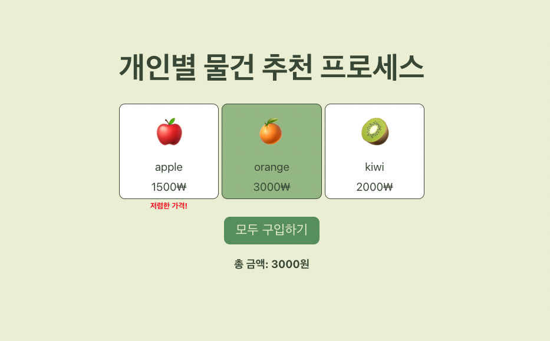

# 리액트에 UI 패턴 사용해보기

> 코드는 [해당 블로그 글](https://velog.io/@eunbinn/modularizing-react-apps?utm_source=substack&utm_medium=email#%EA%B2%B0%EC%A0%9C-%EA%B8%B0%EB%8A%A5-%EA%B5%AC%ED%98%84-%EC%98%88)을 참고해 실습한 내용입니다.
>
> (msw로 작업해 실제로 동작하진 않습니다.)

 
 

### 사용자 별 맞춤형 물건 추천

1. 사용자가 이용한 경험이 있으면 맞춤형 더미 데이터 추천
2. 처음 접속하는 사용자인 경우 일반 더미 데이터 추천

 
 

### 적용 후기

위와 같은 코드를 사용했을 때, 확실히 view, model, hooks가 분리되어 사용하기 쉬워보이며
모듈화되어 코드를 재사용하기 좋아지는 것 같다.
확실히 특정 기능을 추가할 때 코드를 찾아가기는 쉬웠다.

다만, class를 사용하는게 함수형 프로그래밍에 비해 가독성이 떨어져보이고
isSelect를 넣기위해 새로운 state를 만드는것이 어떤 측면으로 좋아보이나, 불필요한 state를 하나 더 만드는 것 같기도 했다.
